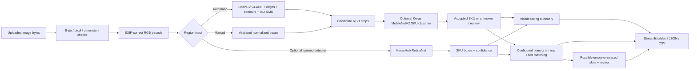

# Architecture

## Data flow

## Modules

- `app.py`: Streamlit workflow, cached model access, error display, image results, downloads, and report tabs.
- `shelfsight/preprocessing.py`: validates byte size, decoded dimensions and pixel count; applies EXIF orientation and RGB conversion.
- `shelfsight/region_proposals.py`: OpenCV CLAHE, bilateral filtering, Canny edges, morphology, contour geometry filters, IoU non-maximum suppression, and a low-confidence shelf-row/vertical-edge fallback when contours return too few regions. This remains a classical heuristic, not a trained detector.
- `shelfsight/keras_hub_detector.py`, `training/train_detector.py`, `evaluation/predict_detector.py`: optional RetinaNet SKU-box training, loading, inference, and held-out prediction export. The code path is experimental and has not been validated on a retail dataset.
- `shelfsight/detection.py`: candidate generation, manual box validation, crop classification, and visualization metadata.
- `shelfsight/classification.py`: validates model metadata, applies a raw softmax score threshold, and emits accepted, unknown, or review statuses. The MobileNetV2 scaling is inside the model graph.
- `shelfsight/inventory.py`: visible-facing counts and count-error metrics.
- `shelfsight/planogram.py`: validates shelf/row/slot configuration and converts the legacy sequence input.
- `shelfsight/compliance.py`: nearest-row assignment followed by nearest unused configured slot matching, mismatch and uncertainty accounting.
- `shelfsight/empty_shelf.py`: flags configured positions with no nearby candidate. This reports possible empty **or missed** detections, never a confirmed stockout.
- `shelfsight/dataset.py`: JSONL annotation validation, checksums, exact duplicates, pHash near-duplicate warnings, and stratified split manifest generation.
- `training/data_loader.py`, `training/train_classifier.py`: product-box crops, augmentation, MobileNetV2 transfer learning, checkpoints, held-out metrics, and model metadata.
- `evaluation/`: command-line detection, inventory, and compliance evaluation for ground-truth records.

The optional RetinaNet uses RGB images scaled to `[0, 1]`; the training data loader and inference adapter apply the same scaling. KerasHub is an optional dependency in `requirements-detector.txt`.

## Model contract

The classifier expects RGB pixel arrays in `[0,255]` and accepts variable crop sizes before resizing to its stored input shape. Training embeds `Rescaling(1/127.5, offset=-1)` into the Keras graph. At inference the raw resized RGB crop is passed to the saved model, so the same graph-level scaling is used. Labels are alphabetically sorted at training and stored beside the model; the model output dimension is checked against the label count.

Softmax scores are not calibrated. The configurable cutoff creates a review/acceptance policy only. Calibration requires validation data and a dedicated procedure; the test set must not tune that cutoff.

## Planogram logic

Each image observation has pixel box coordinates and source image dimensions. Its vertical center is normalized and assigned to the configured row with the nearest `y_center`. Within a row, each expected slot is paired with the closest still-unmatched observation to its configured normalized `x_center`. Slot matching checks SKU and optional center tolerance. Observations with unknown/review status remain review cases; surplus observations are unexpected; unused slots are missing detections.

This is an explicit slot matcher, not a learned shelf geometry model. It does not compensate for perspective, product widths, occlusion, shelf depth, or flexible facings. Review rules before using scores operationally.
